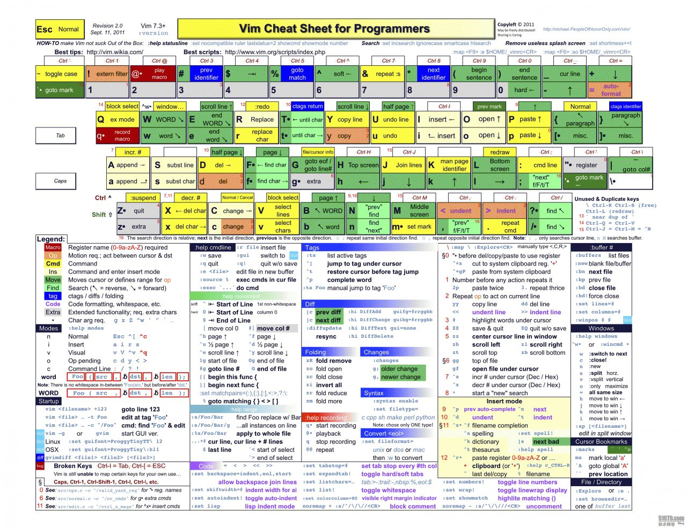

> Author: JunJianSyu <br />
> Slogan: Done is better than perfect

## Vim 安装 & 配置

```bash
// Ubuntu/Debian
apt-get install vim
// Mac
brew install vim
```

根据自己的爱好打造自己喜欢的vim神器

1. `~/.vimrc` 配置文件位置
2. `~/.vim` 插件配色文件位置

*.vimrc*

```bash
# 基本配置
syntax on                   # 自动语法高亮
set wrap                    # 设置自动换行
set nocompatible            # 关闭 vi 兼容模式
set number                  # 显示行号
set nocursorline            # 不突出显示当前行
set nobackup                # 覆盖文件时不备份
set autochdir               # 自动切换当前目录为当前文件所在的目录
set backupcopy=yes          # 设置备份时的行为为覆盖
set autoread                # set to auto read when a file changed from the outside
set ignorecase smartcase    # 搜索时忽略大小写，但在有一个或以上大写字母时仍大小写敏感
set nowrapscan              # 禁止在搜索到文件两端时重新搜索
set incsearch               # 输入搜索内容时就显示搜索结果
set hlsearch                # 搜索时高亮显示被找到的文本
set noerrorbells            # 关闭错误信息响铃
set novisualbell            # 关闭使用可视响铃代替呼叫
set t_vb=                   # 置空错误铃声的终端代码
set showmatch               # 插入括号时，短暂地跳转到匹配的对应括号
set matchtime=2             # 短暂跳转到匹配括号的时间
set nowrap                  # 不自动换行
set magic                   # 显示括号配对情况
set hidden                  # 允许在有未保存的修改时切换缓冲区，此时的修改由 vim 负责保存
set smartindent             # 开启新行时使用智能自动缩进
set backspace=indent,eol,start # 不设定在插入状态无法用退格键和 Delete 键删除回车符
set cmdheight=1             # 设定命令行的行数为 1
set laststatus=2            # 显示状态栏 (默认值为 1, 无法显示状态栏)
set foldenable              # 开始折叠
set foldmethod=syntax       # 设置语法折叠
set foldcolumn=0            # 设置折叠区域的宽度
set localfoldlevel=1        # 设置折叠层数为
set foldclose=all           # 设置为自动关闭折叠
set encoding=utf-8 fileencodings=ucs-bom,utf-8,cp936 #编码设置

# 行末状态信息
set statusline=\ %<%F[%1*%M%*%n%R%H]%=\ %y\ %0(%{&fileformat}\ [%{(&fenc==\"\"?&enc:&fenc).(&bomb?\",BOM\":\"\")}]\ %c:%l/%L%)\

# tab & space
set tabstop=4
set smarttab
set shiftwidth=4            # 设定 << 和 >> 命令移动时的宽度为 4
set softtabstop=4           # 使得按退格键时可以一次删掉 4 个空格
set expandtab               # 禁掉tab

# 显示特殊字符
set list # 展示不可见字符
set listchars=eol:$,tab:>-,trail:~,extends:>,precedes:<

# 保存自动清除行末空格
autocmd BufWritePre * :%s/\s\+$//e
```

## Command

| Command | Action |
|:-------:|:----:|
| h 或 左方向键(←)  | 光标向左移动一个字符 |
| j 或 下方向键(↓)   | 光标向下移动一个字符 |
| k 或 上方向键(↑)   | 光标向上移动一个字符 |
| l 或 右方向键(→)   | 光标向右移动一个字符 |
| [Ctrl] + f        | 向下移动一页        |
| [Ctrl] + b        | 向上移动一页        |
| [Ctrl] + d        | 向下移动半页        |
| [Ctrl] + u        | 向上移动半页        |
| :/word            | 在光标之下寻找为word的字符串 |
| :?word            | 在光标之上寻找为word的字符串 |
| n | 重复上一个搜索动作,向下搜索 |
| N | 重复上一个搜索动作,向上搜索 |
| :n1,n2s/word1/word2/g | n1,n2为数字 在n1-n2列中寻找Word1字符串,并替换为word2 |
| x,X | x为向后删除一个字符,X是向前删除一个字符 |
| nx | n为数字,连续删除n个字符 |
| dd | 删除光标当前行 |
| ndd | n为数字,删除光标以下n行 |
| yy | 复制光标所在的一行 |
| nyy | 复制光标以下n行 |
| p,P | p 将复制的内容粘贴在光标下列, P为上列 |
| J | 将光标所在列和下一列合成同意列 |
| [Ctrl] + r | 重复上一个动作 |
| . | 重复上一个动作 |
| i,I,a,A,o,O | 进入插入模式 |
| [Esc] | 退出编辑模式 |
| :w | 将编辑的内容写入文档 |
| :w! | 强制写入 |
| :q | 退出vim |
| :q! | 强制退出不保存 |
| :wq | 写入文档退出 |
| ZZ | 文档被修改,则储存离开,没被修改不储存离开 |
| :n1,n2 w [filename] | 将 n1-n2 的内容储存为 filename 文档 |


## Vim 指令图
<a href="http://docs.imsyu.com/media/timg.jpeg" target="_blank">
    
</a>

## Vim 插件

> Set a number of long, own martial arts<br/>
> 集多家之长，自创武学

俗话说的好,真正的武学宗师。都自创武学,那我们就观摩琅嬛玉洞[VimAwesome](http://vimawesome.com/)

插件`install`直接使用`git clone`至`~/.vim`然后配置文件即可


